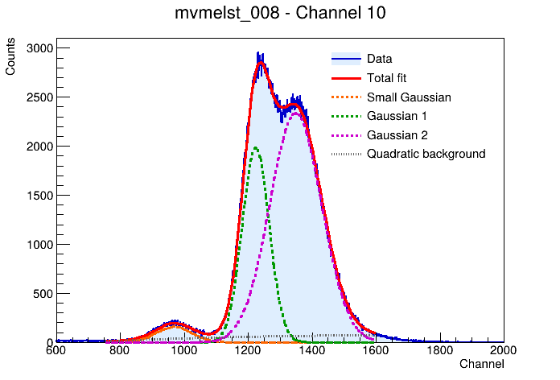

# Double_GaussianPeak

Reproducible PyROOT analysis of a binned spectrum: separating a small peak near channel 970 from background and two larger neighboring peaks.

The project retains three approaches from `BikashROOTFile.ipynb`, with independent entry points, portable data paths, saved figures, and fit diagnostics. The repository name is retained, but the global model contains **three Gaussians**, including the small peak of interest.



## Start here

Install [ROOT](https://root.cern/install/) with its matching Python interpreter. An environment specification is included:

```bash
conda env create -f environment.yml
conda activate gaussian-peaks
python -c 'import ROOT; print(ROOT.gROOT.GetVersion())'
python -m analysis.three_gaussian --strict
```

Run commands from the repository root. The analysis was tested locally with Python 3.13 and ROOT 6.36.04; the Conda environment recipe itself has not been independently provisioned.

```bash
python -m analysis.crystal_ball
python -m analysis.sideband
python -m unittest discover -s tests -v
jupyter lab
```

Each analysis writes `fit.json` and PNG figures to `results/<method>/`. JSON includes fit status, covariance quality, parameter bounds, covariance matrix, ROOT version, and the input checksum. `--strict` exits with an error when numerical checks fail, after saving diagnostics. Numerical success alone does not establish a physically correct model.

To use another uniformly binned histogram with comparable peak positions:

```bash
python -m analysis.three_gaussian --input path/to/file.root --histogram h_name --output results/custom
```

Fit windows, starting parameters, and limits are visible near the top of each method's `main()` function. These defaults are specific to the supplied spectrum.

## Methods and current findings

| Method | Fit region (channel) | Role | Result of local validation |
|---|---:|---|---|
| Three Gaussians + quadratic background | 750–1600 | Baseline global fit | Status 0; full covariance; small-peak mean ≈968.17, sigma ≈55.25 |
| Right-tailed Crystal Ball + continuous piecewise background | 750–1120 | Exploratory local fit | Status 2; unreliable uncertainties; join reaches its bound |
| Linear + exponential sideband background | 50 bins on each side of 820–1100 | Alternative background subtraction | Slope reaches its bound; uncertainty excludes background-fit uncertainty |

The baseline Gaussian signal integral within fitted mean ±3 sigma is approximately **21,902.69 counts**. This is a model-dependent signal yield, not the observed total in those bins. The sideband estimate is approximately **20,778.91 counts** over channels 820–1100, with **181.47 counts data-only error**. Their integration windows and background assumptions differ, so these numbers are not direct estimates of the same quantity.

Read [the scientific review](docs/methods.md) before interpreting the yields. No calibrated energy scale, acquisition metadata, or physical peak assignments were supplied.

## Repository layout

- `analysis/`: independent methods and shared input/diagnostic utilities.
- `notebooks/`: three short notebook entry points that run and display the corresponding method.
- `data/`: original ROOT input and provenance notes.
- `archive/BikashROOTFile.ipynb`: byte-for-byte original notebook, including historical outputs.
- `docs/`: scientific review and a baseline figure generated during validation.
- `tests/`: input, failure-handling, and fit regression checks.

The archive is a historical reference and retains its original Colab paths and exploratory issues. Use the new entry points for reproducible runs. Generated `results/` are ignored by Git.

## Attribution and reuse

Prepared from the notebook and ROOT file supplied by the repository owner. Original filenames are preserved for provenance; no institutional affiliation is implied. A software or data license has not been assigned. Attribution, acquisition details, and reuse terms should be supplied by the owner.
